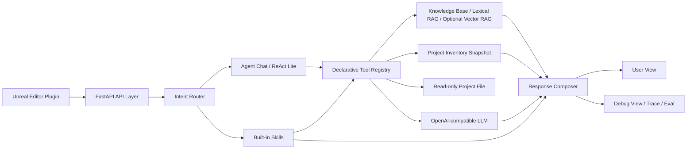

# UE Agent Backend Architecture

本文用于面试展示和后续维护，说明当前后端如何组成一个面向 Unreal Engine 研发管线的轻量 Agent 系统。

## 架构图

## 核心分层

- `API Layer`：`app/api/routes/`，提供 system、chat runs、tasks、sessions、knowledge base、project inventory 等接口。
- `Intent Router`：`app/agent/router.py`，判断 direct answer、project QA、single tool、workflow。
- `Tool Registry`：`app/tools/registry.py`，集中声明工具能力卡、触发词、输入字段、副作用级别和超时。
- `Skill Executors`：`app/skills/executors/`，承接 Code Review、Code Generate、Logs Analyze、Assets Inspect。
- `Knowledge Base`：`app/services/kb_service.py`，支持本地 Markdown / code lexical retrieval，并可选接入 Embedding + Qdrant。
- `Project Inventory`：`app/services/project_inventory_service.py`，读取 UE 插件提交的资产和代码快照。
- `LLM Service`：`app/services/llm_service.py`，统一 OpenAI-compatible 调用、JSON 输出和降级逻辑。
- `Observability`：User View 面向普通使用，Debug View 暴露 route、retrieval、tool calls、react loop、validation plan。

## Agent 边界

当前项目采用“固定内置 Skill + 声明式 Tool Registry + ReAct Lite”的组合：

- 自由聊天和项目问答可以判断是否查知识库或项目快照。
- 工具任务保持稳定同步执行，不让 LLM 直接改文件或执行危险操作。
- ReAct Lite 支持受控工具选择：LLM 可建议 `retrieve_project_knowledge`、`query_project_inventory`、`read_project_file`，后端做白名单和安全校验。
- 所有写入 UE 工程的动作都保持 plan-only 或 proposal，不自动执行。

## ReAct Lite 工具安全

- `retrieve_project_knowledge`：只读检索本地知识库。
- `query_project_inventory`：只读查询 UE 插件提交的资产/代码快照。
- `read_project_file`：只读读取 `project_root` 内的文本/code 文件，限制后缀和读取大小。

LLM 只能建议这些工具，最终是否执行由后端校验决定。LLM 不可用时，后端继续使用 deterministic fallback。

## Tool Contract

`app/tools/registry.py` 是工具单一事实来源，`app/tools/contracts.py` 提供轻量契约校验：

- Registry 自检：启动和 Health 中检查工具元数据是否合法。
- Input contract：ReAct 工具调用前校验 required/type。
- Output contract：工具执行后校验结果是否满足 Debug View 可消费结构。

这层设计用于保证个人作品级稳定性，不做运行时插件市场或企业级 schema 平台。

## Self-Reflection

回答生成后，后端会执行一次轻量自检：

- answer 是否存在。
- Project QA 是否有 KB / Inventory / File evidence。
- confidence 是否低于阈值。
- 是否出现降级 warning。

自检结果进入 `data.self_reflection`、`debug_view.self_reflection` 和 Agent Decision Trace。它不额外调用 LLM，目标是让调试和面试展示更清楚。

## Lightweight Long-Term Memory

长期记忆采用作品级实现：

- 存储：`sessions.metadata_json.long_term_memory_items`。
- 抽取：确定性规则识别“请记住 / 项目约定 / UE 版本 / 命名前缀 / 用户偏好”。
- 召回：按 `project_name` 过滤，再用关键词 overlap 排序。
- 注入：进入 Context Bundle 的 `long_term_memory`，并出现在 prompt excerpt 和 Debug View。

它不依赖 Qdrant，不做用户画像，也不做图记忆。

## Evaluation Loop

项目保留轻量评估闭环：

- 单元、集成、契约和 eval 测试覆盖核心路径。
- `scripts/run_rag_eval.py` 使用固定 JSONL case 验证检索命中、路由、语言和引用覆盖。
- `--markdown-output docs/rag-eval-report.md` 可生成面试展示报告。
- CI 只跑 smoke 级校验，不做线上监控、A/B 或大规模 benchmark。

## Optional Streaming Path

聊天链路保留两种入口：

- 非流式：`POST /api/v1/chat/runs`，返回完整 `UnifiedTaskResponse`。
- 可选流式：`POST /api/v1/chat/runs/stream`，返回 SSE 事件。

流式事件用于 Agent Chat / Project QA：

- `tool_call/tool_result` 描述只读工具进度。
- `assistant_delta` 推送最终 LLM 回答的文本增量。
- `final` 返回完整响应，用于前端校准聊天历史和 Debug View。

旧的 `GET /api/v1/chat/runs/{run_id}/events/stream` 仍是历史事件回放，不与实时 token SSE 混用。

这个边界适合个人作品和校招面试：能说明 Agent 架构、工具调用、RAG、上下文、观测和评估，但不把项目扩展成企业级 Agent 平台。
